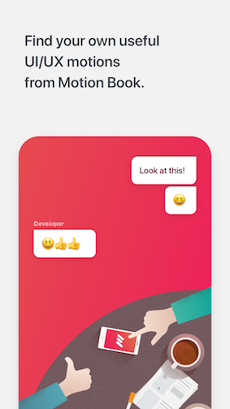
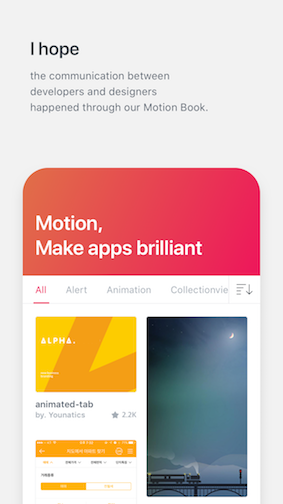
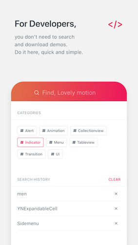
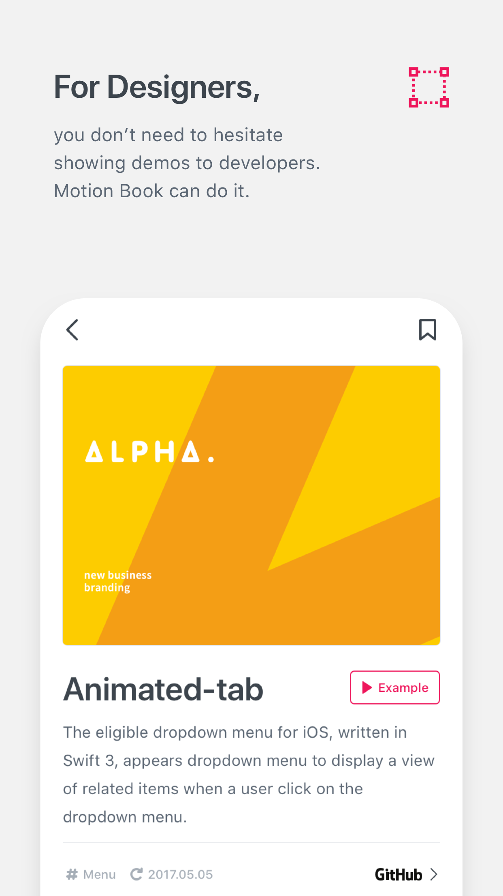
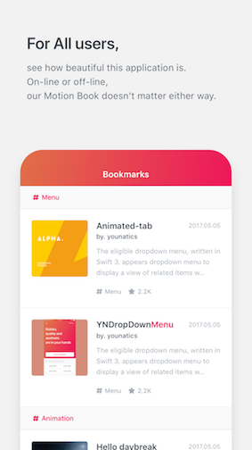

# 📖 MotionBook (UI/UX Animation Book)

MotionBook will show below libraries with examples. You can search and bookmark whatever you want. Also, MotionBook will automatically refresh according to below datas. Appstore intro support English, Korean, Chinease.

## Contribution 
Please see [CONTRIBUTING.md](/CONTRIBUTING.md)

## Used Library 
### Categories
- [Menu](#menu)
- [Indicator](#indicator)
- [Collectionview](#collectionview)
- [Tableview](#tableview)
- [Transition](#transition)
- [Alert](#alert)
- [Animation](#animation)
- [UI](#ui)

---
### Menu
#### `YNDropDownMenu`
- Author: younatics
- Git: https://github.com/younatics/YNDropDownMenu
- Detail: ✨The eligible dropdown menu, written in Swift 3, appears dropdown menu to display a view of related items when a user click on the dropdown menu. You can customize dropdown view whatever you like (e.g. UITableView, UICollectionView... etc)
- Cocoapods: true
- Carthage: true
- Type: Menu

#### `Side-Menu.iOS`
- Author: Yalantis
- Git: https://github.com/Yalantis/Side-Menu.iOS
- Detail: Animated side menu with customizable UI. Made in Yalantis.
- Cocoapods: true
- Carthage: false
- Type: Menu

#### `circle-menu`
- Author: Ramotion
- Git: https://github.com/Ramotion/circle-menu
- Detail: This project is maintained by Ramotion, Inc. We specialize in the designing and coding of custom UI for Mobile Apps and Websites.
- Cocoapods: true
- Carthage: true
- Type: Menu

#### `GuillotineMenu`
- Author: Yalantis
- Git: https://github.com/Yalantis/GuillotineMenu
- Detail: Our Guillotine Menu Transitioning Animation implemented in Swift reminds a bit of a notorious killing machine.
- Cocoapods: true
- Carthage: false
- Type: Menu

#### `SideMenu`
- Author: jonkykong
- Git: https://github.com/jonkykong/SideMenu
- Detail: Simple side menu control for iOS in Swift inspired by Facebook. Right and Left sides. No coding required. iOS 8+.
- Cocoapods: true
- Carthage: true
- Type: Menu

#### `SlideMenuControllerSwift`
- Author: dekatotoro
- Git: https://github.com/dekatotoro/SlideMenuControllerSwift
- Detail: iOS Slide Menu View based on Google+, iQON, Feedly, Ameba iOS app. It is written in pure swift.
- Cocoapods: true
- Carthage: true
- Type: Menu

#### `animated-tab-bar`
- Author: Ramotion
- Git: https://github.com/Ramotion/animated-tab-bar
- Detail: RAMAnimatedTabBarController is a Swift module for adding animation to tabbar items.
- Cocoapods: true
- Carthage: true
- Type: Menu

---
### Animation
#### `Highlighter`
- Author: younatics
- Git: https://github.com/younatics/Highlighter
- Detail: 🖍Highlight whatever you want! Highlighter will magically find UI objects such as UILabel, UITextView, UITexTfield, UIButton in your UITableViewCell or other Class.
- Cocoapods: true
- Carthage: true
- Type: Animation

#### `Spring`
- Author: MengTo
- Git: https://github.com/MengTo/Spring
- Detail: A library to simplify iOS animations in Swift.
- Cocoapods: true
- Carthage: false
- Type: Animation

#### `RQShineLabel`
- Author: zipme
- Git: https://github.com/zipme/RQShineLabel
- Detail: A UILabel subclass that lets you animate text similar to Secret app.
- Cocoapods: true
- Carthage: false
- Type: Animation

#### `FLAnimatedImage`
- Author: Flipboard
- Git: https://github.com/Flipboard/FLAnimatedImage
- Detail: FLAnimatedImage is a performant animated GIF engine for iOS: 1. Plays multiple GIFs simultaneously with a playback speed comparable to desktop browsers 2. Honors variable frame delays 3. Behaves gracefully under memory pressure 4. Eliminates delays or blocking during the first playback loop 5. Interprets the frame delays of fast GIFs the same way modern browsers do
- Cocoapods: true
- Carthage: false
- Type: Animation

#### `YLGIFImage`
- Author: liyong03
- Git: https://github.com/liyong03/YLGIFImage
- Detail: Asynchronized GIF image class and Image viewer supporting play/stop GIF images. It just use very less memory. Following GIF usually will cost almost 600MB memory if it is fully decoded (800x600x389x4 Bytes), but using YLGIFImage, it just use about 30MB memory.
- Cocoapods: true
- Carthage: false
- Type: Animation

#### `Stellar`
- Author: AugustRush
- Git: https://github.com/AugustRush/Stellar
- Detail: A fantastic Physical animation library for swift(Not Just Spring !!!), it is base on UIDynamic and extension to it, friendly APIs make you use it or custom your own animation very easily!
- Cocoapods: true
- Carthage: true
- Type: Animation

#### `Macaw`
- Author: exyte
- Git: https://github.com/exyte/Macaw
- Detail: Powerful and easy-to-use vector graphics Swift library with SVG support
- Cocoapods: true
- Carthage: true
- Type: Animation

#### `Pastel`
- Author: cruisediary
- Git: https://github.com/cruisediary/Pastel
- Detail: 🎨Gradient animation effect like Instagram
- Cocoapods: true
- Carthage: true
- Type: Animation

#### `Gecco`
- Author: yukiasai
- Git: https://github.com/yukiasai/Gecco
- Detail: Simply highlight items for your tutorial walkthrough, written in Swift. Gecco means Moonlight in Japanese.
- Cocoapods: true
- Carthage: true
- Type: Animation

#### `ScrollableGraphView`
- Author: philackm
- Git: https://github.com/philackm/ScrollableGraphView
- Detail: An adaptive scrollable graph view for iOS to visualise simple discrete datasets. Written in Swift.
- Cocoapods: true
- Carthage: true
- Type: Animation

#### `GlitchLabel`
- Author: kciter
- Git: https://github.com/kciter/GlitchLabel
- Detail: G..lit...c...hing UILa..bel fo..r iO...S
- Cocoapods: true
- Carthage: true
- Type: Animation

#### `RevealingSplashView`
- Author: PiXeL16
- Git: https://github.com/PiXeL16/RevealingSplashView
- Detail: A Splash view that animates and reveals its content, inspired by Twitter splash
- Cocoapods: true
- Carthage: true
- Type: Animation

#### `paper-switch`
- Author: Ramotion
- Git: https://github.com/Ramotion/paper-switch
- Detail: RAMPaperSwitch is a Swift material design UI module which paints over the parent view when the switch is turned on.
- Cocoapods: true
- Carthage: true
- Type: Animation

#### `SkeletonView`
- Author: Juanpe
- Git: https://github.com/Juanpe/SkeletonView
- Detail: Today almost all apps have async processes, such as Api requests, long running processes, etc. And while the processes are working, usually developers place a loading view to show users that something is going on.SkeletonView has been conceived to address this need, an elegant way to show users that something is happening and also prepare them to which contents he is waiting.
- Cocoapods: true
- Carthage: true
- Type: Animation

#### `Windless`
- Author: Interactive-Studio
- Git: https://github.com/Interactive-Studio/Windless
- Detail: Windless makes it easy to implement invisible layout loading view.
- Cocoapods: true
- Carthage: true
- Type: Animation

#### `Ease`
- Author: roberthein
- Git: https://github.com/roberthein/Ease
- Detail: Ease is a event driven animation system that combines the observer pattern with custom spring animations as observers.
- Cocoapods: true
- Carthage: false
- Type: Animation

#### `URWeatherView`
- Author: jegumhon
- Git: https://github.com/jegumhon/URWeatherView
- Detail: Show the weather effects onto view written in Swift3
- Cocoapods: true
- Carthage: true
- Type: Animation

#### `AnimatedMaskLabel`
- Author: imjog
- Git: https://github.com/imjog/AnimatedMaskLabel
- Detail: Nice gradient animated label that enable an easy way to add a shimmering effect
- Cocoapods: true
- Carthage: true
- Type: Animation

---
### Transition
#### `AnimatedTransitionGallery`
- Author: shu223
- Git: https://github.com/shu223/AnimatedTransitionGallery
- Detail: Collection of custom animated transitions for iOS using UIViewControllerAnimatedTransitioning protocol.
- Cocoapods: false
- Carthage: false
- Type: Transition

#### `Hero`
- Author: lkzhao
- Git: https://github.com/lkzhao/Hero
- Detail: Hero is a library for building iOS view controller transitions. It provides a layer on top of the UIKit's cumbersome transition APIs. Making custom transitions an easy task for developers.
- Cocoapods: true
- Carthage: true
- Type: Transition

#### `PinterestSwift`
- Author: demonnico
- Git: https://github.com/demonnico/PinterestSwift
- Detail: This is a Swift based demo project to show how to make the transition Pinterest liked.
- Cocoapods: false
- Carthage: false
- Type: Transition

#### `JTMaterialTransition`
- Author: jonathantribouharet
- Git: https://github.com/jonathantribouharet/JTMaterialTransition
- Detail: An iOS transition for controllers based on material design.
- Cocoapods: true
- Carthage: false
- Type: Transition

#### `TKSubmitTransition`
- Author: entotsu
- Git: https://github.com/entotsu/TKSubmitTransition
- Detail: Animated UIButton of Loading Animation and Transition Animation.
- Cocoapods: true
- Carthage: false
- Type: Transition

#### `AnimatedCollectionViewLayout`
- Author: KelvinJin
- Git: https://github.com/KelvinJin/AnimatedCollectionViewLayout
- Detail: Animated UIButton of Loading Animation and Transition Animation.
- Cocoapods: true
- Carthage: false
- Type: Transition

#### `preview-transition`
- Author: Ramotion
- Git: https://github.com/Ramotion/preview-transition
- Detail: PreviewTransition is a simple preview gallery controller
- Cocoapods: true
- Carthage: true
- Type: Transition

#### `CKWaveCollectionViewTransition`
- Author: CezaryKopacz
- Git: https://github.com/CezaryKopacz/CKWaveCollectionViewTransition
- Detail: Cool wave like transition between two or more UICollectionView
- Cocoapods: true
- Carthage: false
- Type: Transition

#### `BWWalkthrough`
- Author: ariok
- Git: https://github.com/ariok/BWWalkthrough
- Detail: BWWalkthrough (BWWT) is a class that helps you create Walkthroughs for your iOS Apps. It differs from other similar classes in that there is no rigid template; BWWT is just a layer placed over your controllers that gives you complete freedom on the design of your views.
- Cocoapods: true
- Carthage: true
- Type: Transition

#### `Gemini`
- Author: shoheiyokoyama
- Git: https://github.com/shoheiyokoyama/Gemini
- Detail: Gemini is rich scroll based animation framework for iOS, written in Swift.
- Cocoapods: true
- Carthage: true
- Type: Transition

#### `AMWaveTransition`
- Author: andreamazz
- Git: https://github.com/andreamazz/AMWaveTransition
- Detail: Custom transition between viewcontrollers holding tableviews. Each cell is animated to simulate a 'wave effect'.
- Cocoapods: true
- Carthage: true
- Type: Transition

#### `XLPagerTabStrip`
- Author: xmartlabs
- Git: https://github.com/xmartlabs/XLPagerTabStrip
- Detail: XLPagerTabStrip is a Container View Controller that allows us to switch easily among a collection of view controllers. Pan gesture can be used to move on to next or previous view controller. It shows a interactive indicator of the current, previous, next child view controllers.
- Cocoapods: true
- Carthage: true
- Type: Transition

#### `BubbleTransition`
- Author: andreamazz
- Git: https://github.com/andreamazz/BubbleTransition
- Detail: A custom modal transition that presents and dismiss a controller inside an expanding and shrinking bubble.
- Cocoapods: true
- Carthage: true
- Type: Transition

#### `ElasticTransition`
- Author: lkzhao
- Git: https://github.com/lkzhao/ElasticTransition
- Detail: A UIKit custom transition that simulates an elastic drag. Written in Swift.
- Cocoapods: true
- Carthage: false
- Type: Transition

---
### Tableview
#### `YNExpandableCell`
- Author: younatics
- Git: https://github.com/younatics/YNExpandableCell
- Detail: ✨Easiest usage of expandable & collapsible cell for iOS, written in Swift 3. You can customize expandable UITableViewCell whatever you like. YNExpandableCell is made because insertRows and deleteRows is hard to use. You can just inheirt YNTableViewDelegate and add one more method func tableView(_ tableView: YNTableView, expandCellAt indexPath) -> UITableViewCell?
- Cocoapods: true
- Carthage: true
- Type: Tableview

#### `Pull-to-Refresh.Rentals-iOS`
- Author: Yalantis
- Git: https://github.com/Yalantis/Pull-to-Refresh.Rentals-iOS
- Detail: This project aims to provide a simple and customizable pull to refresh implementation.
- Cocoapods: true
- Carthage: false
- Type: Tableview

#### `SwipeCellKit`
- Author: jerkoch
- Git: https://github.com/jerkoch/SwipeCellKit
- Detail: Swipeable UITableViewCell based on the stock Mail.app, implemented in Swift.
- Cocoapods: true
- Carthage: true
- Type: Tableview

#### `folding-cell`
- Author: Ramotion
- Git: https://github.com/Ramotion/folding-cell
- Detail: FoldingCell is an expanding content cell inspired by folding paper material
- Cocoapods: true
- Carthage: true
- Type: Tableview

#### `elongation-preview`
- Author: Ramotion
- Git: https://github.com/Ramotion/elongation-preview
- Detail: ElongationPreview is an elegant push-pop style view controller
- Cocoapods: true
- Carthage: true
- Type: Tableview

---
### Collectionview
#### `expanding-collection`
- Author: Ramotion
- Git: https://github.com/Ramotion/expanding-collection
- Detail: This project aims to provide a simple and customizable pull to refresh implementation.
- Cocoapods: true
- Carthage: true
- Type: Collectionview

#### `Koloda`
- Author: Yalantis
- Git: https://github.com/Yalantis/Koloda
- Detail: KolodaView is a class designed to simplify the implementation of Tinder like cards on iOS.
- Cocoapods: true
- Carthage: true
- Type: Collectionview

#### `MMCardView`
- Author: MillmanY
- Git: https://github.com/MillmanY/MMCardView
- Detail: Custom CollectionView like Wallet App
- Cocoapods: true
- Carthage: false
- Type: Collectionview

#### `CSStickyHeaderFlowLayout`
- Author: CSStickyHeaderFlowLayout
- Git: https://github.com/CSStickyHeaderFlowLayout/CSStickyHeaderFlowLayout
- Detail: UICollectionView replacement of UITableView. Do even more like Parallax Header, Sticky Section Header. Made for iOS 7.
- Cocoapods: true
- Carthage: true
- Type: Collectionview

#### `GSKStretchyHeaderView`
- Author: gskbyte
- Git: https://github.com/gskbyte/GSKStretchyHeaderView
- Detail: GSKStretchyHeaderView is an implementation of the stretchy header paradigm as seen on many apps, like Twitter, Spotify or airbnb.
- Cocoapods: true
- Carthage: true
- Type: Collectionview

#### `SwiftSpreadsheet`
- Author: stuffrabbit
- Git: https://github.com/stuffrabbit/SwiftSpreadsheet
- Detail: Spreadsheet CollectionViewLayout in Swift. Fully customizable.
- Cocoapods: true
- Carthage: false
- Type: Collectionview

---
### Indicator
#### `NVActivityIndicatorView`
- Author: ninjaprox
- Git: https://github.com/ninjaprox/NVActivityIndicatorView
- Detail: NVActivityIndicatorView is a collection of awesome loading animations.
- Cocoapods: true
- Carthage: true
- Type: Indicator

#### `TKRubberIndicator`
- Author: TBXark
- Git: https://github.com/TBXark/TKRubberIndicator
- Detail: A rubber animation pagecontrol
- Cocoapods: true
- Carthage: true
- Type: Indicator

#### `SpringIndicator`
- Author: KyoheiG3
- Git: https://github.com/KyoheiG3/SpringIndicator
- Detail: SpringIndicator is indicator and PullToRefresh. Inspired by Material design components.
- Cocoapods: true
- Carthage: true
- Type: Indicator

#### `BusyNavigationBar`
- Author: gmertk
- Git: https://github.com/gmertk/BusyNavigationBar
- Detail: A UINavigationBar extension to show loading effects above navigation bar's background.
- Cocoapods: true
- Carthage: true
- Type: Indicator

#### `PKHUD`
- Author: pkluz
- Git: https://github.com/pkluz/PKHUD
- Detail: A Swift based reimplementation of the Apple HUD (Volume, Ringer, Rotation,…) for iOS 8.
- Cocoapods: true
- Carthage: true
- Type: Indicator

### Alert
#### `CRToast`
- Author: cruffenach
- Git: https://github.com/cruffenach/CRToast
- Detail: CRToast is a library that allows you to easily create notifications that appear on top of or by pushing out the status bar or navigation bar.
- Cocoapods: true
- Carthage: true
- Type: Alert

#### `SDCAlertView`
- Author: sberrevoets
- Git: https://github.com/sberrevoets/SDCAlertView
- Detail: SDCAlertView started out as an alert that looked identical to UIAlertView, but had support for a custom content view. With the introduction of UIAlertController in iOS 8, the project was updated to the more modern API that UIAlertController brought.
- Cocoapods: true
- Carthage: true
- Type: Alert

#### `CDAlertView`
- Author: candostdagdeviren
- Git: https://github.com/candostdagdeviren/CDAlertView
- Detail: CDAlertView is highly customizable alert popup written in Swift 3. Usage is similar to UIAlertController.
- Cocoapods: true
- Carthage: true
- Type: Alert

#### `PopupDialog`
- Author: Orderella
- Git: https://github.com/Orderella/PopupDialog
- Detail: A simple, customizable popup dialog for iOS written in Swift. Replaces UIAlertController alert style.
- Cocoapods: true
- Carthage: true
- Type: Alert

#### `SweetAlert-iOS`
- Author: codestergit
- Git: https://github.com/codestergit/SweetAlert-iOS
- Detail: Beautiful Animated custom Alert View inspired from javascript library SweetAlert. Written in Swift this SweetAlertView can be used in Swift and Objective-C projects. SweetAlertView provides live intutive experience to user actions.It can be used in place of UIAlertView and UIAlertController
- Cocoapods: false
- Carthage: false
- Type: Alert

#### `TKSwarmAlert`
- Author: entotsu
- Git: https://github.com/entotsu/TKSwarmAlert
- Detail: Animated alert library like Swarm app.
- Cocoapods: true
- Carthage: true
- Type: Alert

#### `MIBlurPopup`
- Author: MarioIannotta
- Git: https://github.com/MarioIannotta/MIBlurPopup
- Detail: MIBlurPopup lets you create amazing popups with a blurred background
- Cocoapods: true
- Carthage: false
- Type: Alert

#### `GoogleWearAlert`
- Author: AshRobinson
- Git: https://github.com/AshRobinson/GoogleWearAlert
- Detail: An Android Wear style confirmation view for iOS
- Cocoapods: false
- Carthage: false
- Type: Alert

#### `NotificationBanner`
- Author: Daltron
- Git: https://github.com/Daltron/NotificationBanner
- Detail: NotificationBanner is an extremely customizable and lightweight library that makes the task of displaying in app notification banners and drop down alerts an absolute breeze in iOS.
- Cocoapods: true
- Carthage: true
- Type: Alert
---

### UI
#### `YNSearch`
- Author: younatics
- Git: https://github.com/younatics/YNSearch
- Detail: ✨Awesome search view, written in Swift 3, appears search view like Pinterest Search view. You can fully customize this library. You can also use this library with Realm!
- Cocoapods: true
- Carthage: true
- Type: UI

#### `IBAnimatable`
- Author: IBAnimatable
- Git: https://github.com/IBAnimatable/IBAnimatable
- Detail: Design and prototype customized UI, interaction, navigation, transition and animation for App Store ready Apps in Interface Builder with IBAnimatable.
- Cocoapods: true
- Carthage: true
- Type: UI

#### `StarWars.iOS`
- Author: Yalantis
- Git: https://github.com/Yalantis/StarWars.iOS
- Detail: This component implements transition animation to crumble view-controller into tiny pieces.
- Cocoapods: true
- Carthage: false
- Type: UI

#### `Segmentio`
- Author: Yalantis
- Git: https://github.com/Yalantis/Segmentio
- Detail: Animated top/bottom segmented control written in Swift.
- Cocoapods: true
- Carthage: true
- Type: UI

#### `Presentation`
- Author: hyperoslo
- Git: https://github.com/hyperoslo/Presentation
- Detail: Looking for the easiest way of presenting something in your iOS app? Then you are in the right place. Presentation will help you make your tutorials, release notes and any kind of animated pages with the minimum amount of effort.
- Cocoapods: true
- Carthage: true
- Type: UI

#### `LTMorphingLabel`
- Author: lexrus
- Git: https://github.com/lexrus/LTMorphingLabel
- Detail: A morphing UILabel subclass written in Swift. The .Scale effect mimicked Apple's QuickType animation of iOS 8 in WWDC 2014. New morphing effects are available as Swift extensions.
- Cocoapods: true
- Carthage: true
- Type: UI

#### `AIFlatSwitch`
- Author: cocoatoucher
- Git: https://github.com/cocoatoucher/AIFlatSwitch
- Detail: A smooth, nice looking and IBDesignable flat design switch for iOS. Can be used instead of UISwitch. Inspired by Creativedash's Dribbble post
- Cocoapods: true
- Carthage: false
- Type: UI

#### `MarkdownView`
- Author: keitaoouchi
- Git: https://github.com/keitaoouchi/MarkdownView
- Detail: MarkdownView is a WKWebView based UI element, and internally use bootstrap, highlight.js, markdown-it.
- Cocoapods: true
- Carthage: true
- Type: UI

#### `DKNightVersion`
- Author: Draveness
- Git: https://github.com/Draveness/DKNightVersion
- Detail: Manage Colors, Integrate Night/Multiple Themes
- Cocoapods: true
- Carthage: true
- Type: UI

#### `PARTagPicker`
- Author: paulrolfe
- Git: https://github.com/paulrolfe/PARTagPicker
- Detail: This pod provides a view controller for choosing and creating tags in the style of wordpress or tumblr. This tag picker was originally used in the Intrepid Pursuits app, Slate.
- Cocoapods: true
- Carthage: false
- Type: UI

#### `MediaBrowser`
- Author: younatics
- Git: https://github.com/younatics/MediaBrowser
- Detail: 🏞 MediaBrowser can display one or more images or videos by providing either UIImage objects, PHAsset objects, or URLs to library assets, web images/videos or local files. MediaBrowser handles the downloading and caching of photos from the web seamlessly. Photos can be zoomed and panned, and optional (customisable) captions can be displayed. This can also be used to allow the user to select one or more photos using either the grid or main image view.
- Cocoapods: true
- Carthage: true
- Type: UI

#### `Cards`
- Author: PaoloCuscela
- Git: https://github.com/PaoloCuscela/Cards
- Detail: Awesome iOS 11 appstore cards in swift 4.
- Cocoapods: true
- Carthage: false
- Type: UI

#### `fluid-slider`
- Author: Ramotion
- Git: https://github.com/Ramotion/fluid-slider
- Detail: A slider widget with a popup bubble displaying the precise value selected.
- Cocoapods: true
- Carthage: true
- Type: UI

---

### Author

[younatics](https://twitter.com/younatics)

