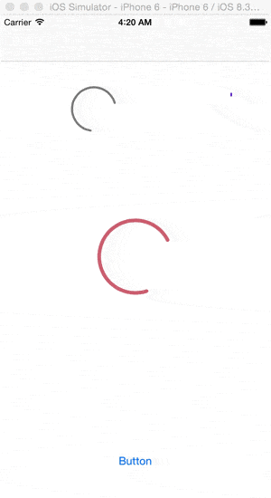
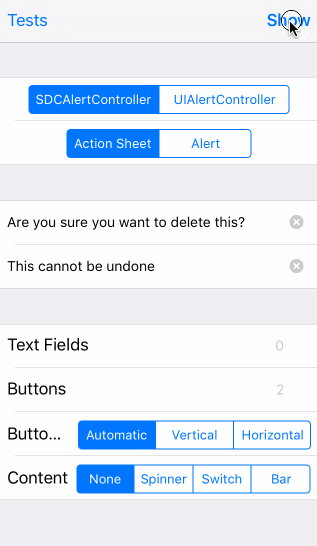
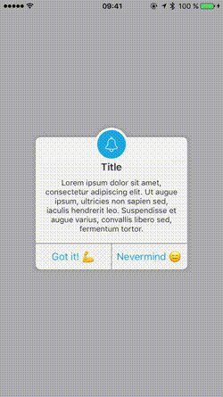

# 📖 Motion Book  iOS(UI/UX Animation Book)

* Will be available at Appstore soon

## Introduction
* This application will show popular open sources with demo files. You can freely make pull request for this project. 

## Used Library 
### Categories
- [Menu](#menu)
- [Indicator](#indicator)
- [Collectionview](#collectionview)
- [Tableview](#tableview)
- [Transition](#transition)
- [Alert](#alert)
- [Animation](#animation)
---
### Menu
#### `YNDropDownMenu`

- Author: younatics
- Git: https://github.com/younatics/YNDropDownMenu
- Gif Url: https://raw.githubusercontent.com/younatics/motion-book-ios/master/motion-book/YNDropDownMenu/YNDropDownMenu.gif
- Detail: The eligible dropdown menu, written in Swift 3, appears dropdown menu to display a view of related items when a user click on the dropdown menu. You can customize dropdown view whatever you like (e.g. UITableView, UICollectionView... etc)
- License: MIT
- Cocoapods: true
- Carthage: true
- Swift Project: true
- Available Library: false
- Type: Menu

#### `Side-Menu.iOS`

- Author: Yalantis
- Git: https://github.com/Yalantis/Side-Menu.iOS
- Gif Url: https://raw.githubusercontent.com/younatics/motion-book-ios/master/motion-book/Side-Menu.iOS/Side-Menu.gif
- Detail: Animated side menu with customizable UI. Made in Yalantis.
- License: MIT
- Cocoapods: true
- Carthage: false
- Swift Project: true
- Available Library: false
- Type: Menu

#### `circle-menu`

- Author: Ramotion
- Git: https://github.com/Ramotion/circle-menu
- Gif Url: https://raw.githubusercontent.com/younatics/motion-book-ios/master/motion-book/circle-menu/circle-menu.gif
- Detail: This project is maintained by Ramotion, Inc. We specialize in the designing and coding of custom UI for Mobile Apps and Websites.
- License: MIT
- Cocoapods: true
- Carthage: true
- Swift Project: true
- Available Library: false
- Type: Menu

#### `GuillotineMenu`

- Author: Yalantis
- Git: https://github.com/Yalantis/GuillotineMenu
- Gif Url: https://raw.githubusercontent.com/younatics/motion-book-ios/master/motion-book/GuillotineMenu/GuillotineMenu.gif
- Detail: Our Guillotine Menu Transitioning Animation implemented in Swift reminds a bit of a notorious killing machine.
- License: MIT
- Cocoapods: true
- Carthage: false
- Swift Project: true
- Available Library: false
- Type: Menu

#### `SideMenu`

- Author: jonkykong
- Git: https://github.com/jonkykong/SideMenu
- Gif Url: https://raw.githubusercontent.com/younatics/motion-book-ios/master/motion-book/SideMenu/SideMenu.gif
- Detail: Simple side menu control for iOS in Swift inspired by Facebook. Right and Left sides. No coding required. iOS 8+.
- License: MIT
- Cocoapods: true
- Carthage: true
- Swift Project: true
- Available Library: false
- Type: Menu

#### `SlideMenuControllerSwift`

- Author: dekatotoro
- Git: https://github.com/dekatotoro/SlideMenuControllerSwift
- Gif Url: https://raw.githubusercontent.com/younatics/motion-book-ios/master/motion-book/SlideMenuControllerSwift/SlideMenuControllerSwift.gif
- Detail: iOS Slide Menu View based on Google+, iQON, Feedly, Ameba iOS app. It is written in pure swift.
- License: MIT
- Cocoapods: true
- Carthage: true
- Swift Project: true
- Available Library: false
- Type: Menu

#### `animated-tab-bar`

- Author: Ramotion
- Git: https://github.com/Ramotion/animated-tab-bar
- Gif Url: https://raw.githubusercontent.com/younatics/motion-book-ios/master/motion-book/animated-tab-bar/animated-tab-bar.gif
- Detail: RAMAnimatedTabBarController is a Swift module for adding animation to tabbar items.
- License: MIT
- Cocoapods: true
- Carthage: true
- Swift Project: true
- Available Library: false
- Type: Menu

#### Animation
#### `FLAnimatedImage`

- Author: Flipboard
- Git: https://github.com/Flipboard/FLAnimatedImage
- Gif Url: https://raw.githubusercontent.com/younatics/motion-book-ios/master/motion-book/FLAnimatedImage/FLAnimatedImage.gif
- Detail: FLAnimatedImage is a performant animated GIF engine for iOS: 1. Plays multiple GIFs simultaneously with a playback speed comparable to desktop browsers 2. Honors variable frame delays 3. Behaves gracefully under memory pressure 4. Eliminates delays or blocking during the first playback loop 5. Interprets the frame delays of fast GIFs the same way modern browsers do
- License: MIT
- Cocoapods: true
- Carthage: false
- Swift Project: false
- Available Library: false
- Type: Animation

#### `YLGIFImage`

- Author: liyong03
- Git: https://github.com/liyong03/YLGIFImage
- Gif Url: https://raw.githubusercontent.com/younatics/motion-book-ios/master/motion-book/YLGIFImage/YLGIFImage.gif
- Detail: Asynchronized GIF image class and Image viewer supporting play/stop GIF images. It just use very less memory. Following GIF usually will cost almost 600MB memory if it is fully decoded (800x600x389x4 Bytes), but using YLGIFImage, it just use about 30MB memory.
- License: MIT
- Cocoapods: true
- Carthage: false
- Swift Project: false
- Available Library: false
- Type: Animation

#### `IBAnimatable`

- Author: IBAnimatable
- Git: https://github.com/IBAnimatable/IBAnimatable
- Gif Url: https://raw.githubusercontent.com/younatics/motion-book-ios/master/motion-book/IBAnimatable/IBAnimatable.gif
- Detail: Design and prototype customized UI, interaction, navigation, transition and animation for App Store ready Apps in Interface Builder with IBAnimatable.
- License: MIT
- Cocoapods: true
- Carthage: true
- Swift Project: true
- Available Library: false
- Type: Animation

#### `Stellar`

- Author: AugustRush
- Git: https://github.com/AugustRush/Stellar
- Gif Url: https://raw.githubusercontent.com/younatics/motion-book-ios/master/motion-book/Stellar/Stellar.gif
- Detail: A fantastic Physical animation library for swift(Not Just Spring !!!), it is base on UIDynamic and extension to it, friendly APIs make you use it or custom your own animation very easily!
- License: MIT
- Cocoapods: true
- Carthage: true
- Swift Project: true
- Available Library: false
- Type: Animation

#### `StarWars.iOS`

- Author: Yalantis
- Git: https://github.com/Yalantis/StarWars.iOS
- Gif Url: https://raw.githubusercontent.com/younatics/motion-book-ios/master/motion-book/StarWars.iOS/StarWars.gif
- Detail: This component implements transition animation to crumble view-controller into tiny pieces.
- License: MIT
- Cocoapods: true
- Carthage: false
- Swift Project: true
- Available Library: false
- Type: Animation

#### `Macaw`

- Author: exyte
- Git: https://github.com/exyte/Macaw
- Gif Url: https://raw.githubusercontent.com/younatics/motion-book-ios/master/motion-book/Macaw/Macaw.gif
- Detail: Powerful and easy-to-use vector graphics Swift library with SVG support
- License: MIT
- Cocoapods: true
- Carthage: true
- Swift Project: true
- Available Library: false
- Type: Animation

#### `Segmentio`

- Author: Yalantis
- Git: https://github.com/Yalantis/Segmentio
- Gif Url: https://raw.githubusercontent.com/younatics/motion-book-ios/master/motion-book/Segmentio/Segmentio.gif
- Detail: Animated top/bottom segmented control written in Swift.
- License: MIT
- Cocoapods: true
- Carthage: true
- Swift Project: true
- Available Library: false
- Type: Animation

### Transition
#### `AnimatedTransitionGallery`

- Author: shu223
- Git: https://github.com/shu223/AnimatedTransitionGallery
- Gif Url: https://raw.githubusercontent.com/younatics/motion-book-ios/master/motion-book/AnimatedTransitionGallery/AnimatedTransitionGallery.gif
- Detail: Collection of custom animated transitions for iOS using UIViewControllerAnimatedTransitioning protocol.
- License: MIT
- Cocoapods: false
- Carthage: false
- Swift Project: false
- Available Library: false
- Type: Transition

#### `Hero`

- Author: lkzhao
- Git: https://github.com/lkzhao/Hero
- Gif Url: https://raw.githubusercontent.com/younatics/motion-book-ios/master/motion-book/Hero/Hero.gif
- Detail: Hero is a library for building iOS view controller transitions. It provides a layer on top of the UIKit's cumbersome transition APIs. Making custom transitions an easy task for developers.
- License: MIT
- Cocoapods: true
- Carthage: true
- Swift Project: true
- Available Library: false
- Type: Transition

#### `PinterestSwift`

- Author: demonnico
- Git: https://github.com/demonnico/PinterestSwift
- Gif Url: https://raw.githubusercontent.com/younatics/motion-book-ios/master/motion-book/PinterestSwift/PinterestSwift.gif
- Detail: This is a Swift based demo project to show how to make the transition Pinterest liked.
- License: MIT
- Cocoapods: false
- Carthage: false
- Swift Project: true
- Available Library: false
- Type: Transition

#### `JTMaterialTransition`

- Author: jonathantribouharet
- Git: https://github.com/jonathantribouharet/JTMaterialTransition
- Gif Url: https://raw.githubusercontent.com/younatics/motion-book-ios/master/motion-book/JTMaterialTransition/JTMaterialTransition.gif
- Detail: An iOS transition for controllers based on material design.
- License: MIT
- Cocoapods: true
- Carthage: false
- Swift Project: true
- Available Library: false
- Type: Transition

#### `TKSubmitTransition`

- Author: entotsu
- Git: https://github.com/entotsu/TKSubmitTransition
- Gif Url: https://raw.githubusercontent.com/younatics/motion-book-ios/master/motion-book/TKSubmitTransition/TKSubmitTransition.gif
- Detail: Animated UIButton of Loading Animation and Transition Animation.
- License: MIT
- Cocoapods: true
- Carthage: false
- Swift Project: true
- Available Library: false
- Type: Transition

#### `AnimatedCollectionViewLayout`

- Author: KelvinJin
- Git: https://github.com/KelvinJin/AnimatedCollectionViewLayout
- Gif Url: https://raw.githubusercontent.com/younatics/motion-book-ios/master/motion-book/AnimatedCollectionViewLayout/AnimatedCollectionViewLayout.gif
- Detail: Animated UIButton of Loading Animation and Transition Animation.
- License: MIT
- Cocoapods: true
- Carthage: false
- Swift Project: true
- Available Library: false
- Type: Transition

#### `preview-transition`

- Author: Ramotion
- Git: https://github.com/Ramotion/preview-transition
- Gif Url: https://raw.githubusercontent.com/younatics/motion-book-ios/master/motion-book/preview-transition/preview-transition.gif
- Detail: PreviewTransition is a simple preview gallery controller
- License: MIT
- Cocoapods: true
- Carthage: true
- Swift Project: true
- Available Library: false
- Type: Transition

#### `CKWaveCollectionViewTransition`

- Author: CezaryKopacz
- Git: https://github.com/CezaryKopacz/CKWaveCollectionViewTransition
- Gif Url: https://raw.githubusercontent.com/younatics/motion-book-ios/master/motion-book/CKWaveCollectionViewTransition/CKWaveCollectionViewTransition.gif
- Detail: Cool wave like transition between two or more UICollectionView
- License: MIT
- Cocoapods: true
- Carthage: false
- Swift Project: true
- Available Library: false
- Type: Transition

### Tableview
#### `YNExpandableCell`

- Author: younatics
- Git: https://github.com/younatics/YNExpandableCell
- Gif Url: https://raw.githubusercontent.com/younatics/motion-book-ios/master/motion-book/YNExpandableCell/YNExpandableCell.gif
- Detail: Easiest usage of expandable & collapsible cell for iOS, written in Swift 3. You can customize expandable UITableViewCell whatever you like. YNExpandableCell is made because insertRows and deleteRows is hard to use. You can just inheirt YNTableViewDelegate and add one more method func tableView(_ tableView: YNTableView, expandCellAt indexPath) -> UITableViewCell?
- License: MIT
- Cocoapods: true
- Carthage: true
- Swift Project: true
- Available Library: false
- Type: Tableview

#### `Pull-to-Refresh.Rentals-iOS`

- Author: Yalantis
- Git: https://github.com/Yalantis/Pull-to-Refresh.Rentals-iOS
- Gif Url: https://raw.githubusercontent.com/younatics/motion-book-ios/master/motion-book/Pull-to-Refresh.Rentals-iOS/Pull-to-Refresh.Rentals-iOS.gif
- Detail: This project aims to provide a simple and customizable pull to refresh implementation.
- License: Apache
- Cocoapods: true
- Carthage: false
- Swift Project: false
- Available Library: false
- Type: Tableview

#### `SwipeCellKit`

- Author: jerkoch
- Git: https://github.com/jerkoch/SwipeCellKit
- Gif Url: https://raw.githubusercontent.com/younatics/motion-book-ios/master/motion-book/SwipeCellKit/SwipeCellKit.gif
- Detail: Swipeable UITableViewCell based on the stock Mail.app, implemented in Swift.
- License: MIT
- Cocoapods: true
- Carthage: true
- Swift Project: true
- Available Library: false
- Type: Tableview

#### `folding-cell`

- Author: Ramotion
- Git: https://github.com/Ramotion/folding-cell
- Gif Url: https://raw.githubusercontent.com/younatics/motion-book-ios/master/motion-book/folding-cell/folding-cell.gif
- Detail: FoldingCell is an expanding content cell inspired by folding paper material
- License: MIT
- Cocoapods: true
- Carthage: true
- Swift Project: true
- Available Library: false
- Type: Tableview

#### `elongation-preview`

- Author: Ramotion
- Git: https://github.com/Ramotion/elongation-preview
- Gif Url: https://raw.githubusercontent.com/younatics/motion-book-ios/master/motion-book/elongation-preview/elongation-preview.gif
- Detail: ElongationPreview is an elegant push-pop style view controller
- License: MIT
- Cocoapods: true
- Carthage: true
- Swift Project: true
- Available Library: false
- Type: Tableview

### Collectionview
#### `expanding-collection`

- Author: Ramotion
- Git: https://github.com/Ramotion/expanding-collection
- Gif Url: https://raw.githubusercontent.com/younatics/motion-book-ios/master/motion-book/expanding-collection/expanding-collection.gif
- Detail: This project aims to provide a simple and customizable pull to refresh implementation.
- License: MIT
- Cocoapods: true
- Carthage: true
- Swift Project: true
- Available Library: true
- Type: Collectionview

#### `Koloda`

- Author: Yalantis
- Git: https://github.com/Yalantis/Koloda
- Gif Url: https://raw.githubusercontent.com/younatics/motion-book-ios/master/motion-book/Koloda/Koloda.gif
- Detail: KolodaView is a class designed to simplify the implementation of Tinder like cards on iOS.
- License: MIT
- Cocoapods: true
- Carthage: true
- Swift Project: true
- Available Library: false
- Type: Collectionview

#### `MMCardView`

- Author: MillmanY
- Git: https://github.com/MillmanY/MMCardView
- Gif Url: https://raw.githubusercontent.com/younatics/motion-book-ios/master/motion-book/MMCardView/MMCardView.gif
- Detail: Custom CollectionView like Wallet App
- License: MIT
- Cocoapods: true
- Carthage: false
- Swift Project: true
- Available Library: false
- Type: Collectionview

### Indicator
#### `NVActivityIndicatorView`

- Author: ninjaprox
- Git: https://github.com/ninjaprox/NVActivityIndicatorView
- Gif Url: https://raw.githubusercontent.com/younatics/motion-book-ios/master/motion-book/NVActivityIndicatorView/NVActivityIndicatorView.gif
- Detail: NVActivityIndicatorView is a collection of awesome loading animations.
- License: MIT
- Cocoapods: true
- Carthage: true
- Swift Project: true
- Available Library: true
- Type: Indicator

#### `TKRubberIndicator`

- Author: TBXark
- Git: https://github.com/TBXark/TKRubberIndicator
- Gif Url: https://raw.githubusercontent.com/younatics/motion-book-ios/master/motion-book/TKRubberIndicator/TKRubberIndicator.gif
- Detail: A rubber animation pagecontrol
- License: MIT
- Cocoapods: true
- Carthage: true
- Swift Project: true
- Available Library: false
- Type: Indicator

#### `SpringIndicator`

- Author: KyoheiG3
- Git: https://github.com/KyoheiG3/SpringIndicator
- Gif Url: https://raw.githubusercontent.com/younatics/motion-book-ios/master/motion-book/SpringIndicator/SpringIndicator.gif
- Detail: SpringIndicator is indicator and PullToRefresh. Inspired by Material design components.
- License: MIT
- Cocoapods: true
- Carthage: true
- Swift Project: true
- Available Library: false
- Type: Indicator

### Alert
#### `CRToast`

- Author: cruffenach
- Git: https://github.com/cruffenach/CRToast
- Gif Url: https://raw.githubusercontent.com/younatics/motion-book-ios/master/motion-book/CRToast/CRToast.gif
- Detail: CRToast is a library that allows you to easily create notifications that appear on top of or by pushing out the status bar or navigation bar.
- License: MIT
- Cocoapods: true
- Carthage: true
- Swift Project: false
- Available Library: true
- Type: Alert

#### `SDCAlertView`

- Author: sberrevoets
- Git: https://github.com/sberrevoets/SDCAlertView
- Gif Url: https://raw.githubusercontent.com/younatics/motion-book-ios/master/motion-book/SDCAlertView/SDCAlertView.gif
- Detail: SDCAlertView started out as an alert that looked identical to UIAlertView, but had support for a custom content view. With the introduction of UIAlertController in iOS 8, the project was updated to the more modern API that UIAlertController brought.
- License: MIT
- Cocoapods: true
- Carthage: true
- Swift Project: true
- Available Library: false
- Type: Alert

#### `CDAlertView`

- Author: candostdagdeviren
- Git: https://github.com/candostdagdeviren/CDAlertView
- Gif Url: https://raw.githubusercontent.com/younatics/motion-book-ios/master/motion-book/CDAlertView/CDAlertView.gif
- Detail: CDAlertView is highly customizable alert popup written in Swift 3. Usage is similar to UIAlertController.
- License: MIT
- Cocoapods: true
- Carthage: true
- Swift Project: true
- Available Library: false
- Type: Alert

#### `PopupDialog`

- Author: Orderella
- Git: https://github.com/Orderella/PopupDialog
- Gif Url: https://raw.githubusercontent.com/younatics/motion-book-ios/master/motion-book/PopupDialog/PopupDialog.gif
- Detail: A simple, customizable popup dialog for iOS written in Swift. Replaces UIAlertController alert style.
- License: MIT
- Cocoapods: true
- Carthage: true
- Swift Project: true
- Available Library: false
- Type: Alert

#### `SweetAlert-iOS`

- Author: codestergit
- Git: https://github.com/codestergit/SweetAlert-iOS
- Gif Url: https://raw.githubusercontent.com/younatics/motion-book-ios/master/motion-book/SweetAlert-iOS/SweetAlert-iOS.gif
- Detail: Beautiful Animated custom Alert View inspired from javascript library SweetAlert. Written in Swift this SweetAlertView can be used in Swift and Objective-C projects. SweetAlertView provides live intutive experience to user actions.It can be used in place of UIAlertView and UIAlertController
- License: MIT
- Cocoapods: false
- Carthage: false
- Swift Project: true
- Available Library: false
- Type: Alert

#### `TKSwarmAlert`

- Author: entotsu
- Git: https://github.com/entotsu/TKSwarmAlert
- Gif Url: https://raw.githubusercontent.com/younatics/motion-book-ios/master/motion-book/TKSwarmAlert/TKSwarmAlert.gif
- Detail: Animated alert library like Swarm app.
- License: MIT
- Cocoapods: true
- Carthage: true
- Swift Project: true
- Available Library: false
- Type: Alert

#### `MIBlurPopup`

- Author: MarioIannotta
- Git: https://github.com/MarioIannotta/MIBlurPopup
- Gif Url: https://raw.githubusercontent.com/younatics/motion-book-ios/master/motion-book/MIBlurPopup/MIBlurPopup.gif
- Detail: MIBlurPopup lets you create amazing popups with a blurred background
- License: MIT
- Cocoapods: true
- Carthage: false
- Swift Project: true
- Available Library: false
- Type: Alert

#### `GoogleWearAlert`

- Author: AshRobinson
- Git: https://github.com/AshRobinson/GoogleWearAlert
- Gif Url: https://raw.githubusercontent.com/younatics/motion-book-ios/master/motion-book/GoogleWearAlert/GoogleWearAlert.gif
- Detail: An Android Wear style confirmation view for iOS
- License: MIT
- Cocoapods: false
- Carthage: false
- Swift Project: true
- Available Library: false
- Type: Alert

---

### Author

**[younatics 🇰🇷](https://younatics.github.io)**
